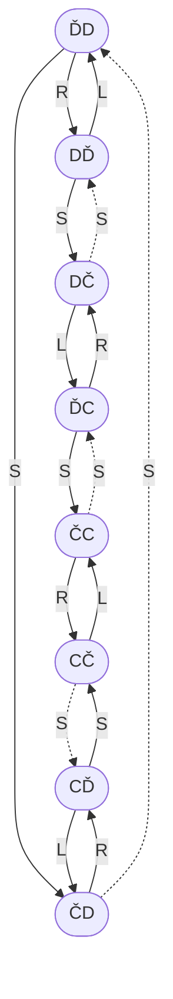
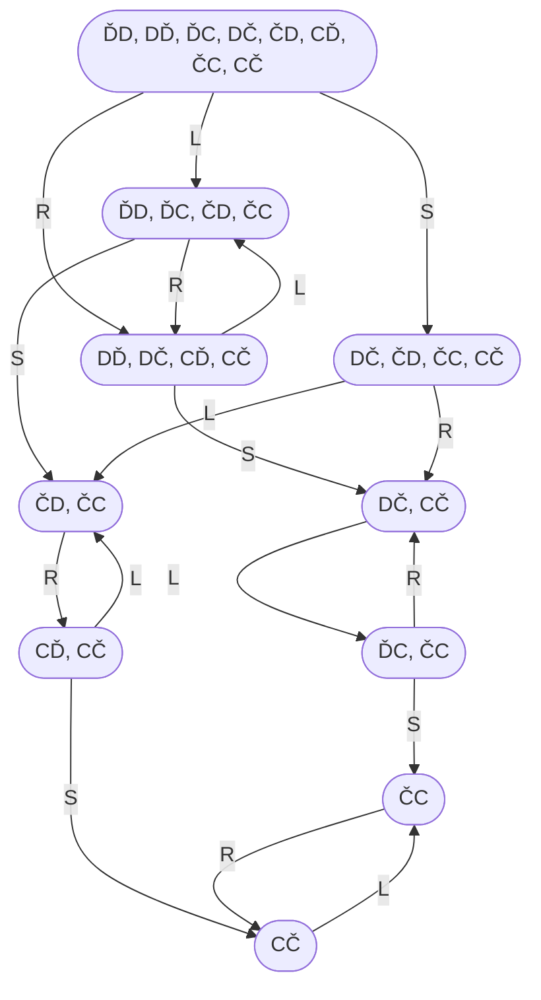

# Problems

## The vacuum world

The vacuum world consists of two locations – left and right. Each location is either dirty or clean. The agent is either on the left or on the right.

There are this eight distinct objective states that the vacuum world can be in:
1. `ĎD` – The agent is on the left, and both the left and right are dirty.
2. `DĎ` – The agent is on the right, and both the left and right are dirty.
3. `ĎC` – The agent is on the left, the left is dirty but the right is clean.
4. `DČ` – The agent is on the right, the left is dirty but the right is clean.
5. `ČD` – The agent is on the left, the left is clean but the right is dirty.
6. `CĎ` – The agent is on the right, the left is clean but the right is dirty.
7. `ČC` – The agent is on the left, and both the left and right are clean.
8. `CČ` – The agent is on the right, and both the left and right are clean.

In the vacuum world, the agent can perform three distinct actions:
1. Move to the left.
2. Move to the right.
3. Activate the vacuum’s suction.

The following three facts all hold:
1. If the agent moves to the left, then it will be on the left.
2. If the agent moves to the right, then it will be on the right.
3. If the agent activates the vacuum’s suction, then its current location will be clean.

The agent knows these three facts.

### Deterministic

Actions:
- `L` – you move to the left
- `R` – you move to the right
- `S` – you activate the suction, which removes all the dirt from where you are

### Non-deterministic

Actions:
- `L` – you move to the left
- `R` – you move to the right
- `S` – you activate the suction, which either removes all the dirt from where you are, or deposits more dirt where you are, randomly

### No sensors

### Local dirt sensor – you know if there is dirt where you are

### Next door dirt sensor – you know if there is dirt next door

----

Back up to: [Maglocunus](../index.md)
