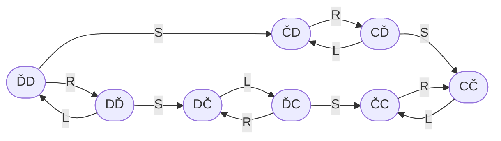
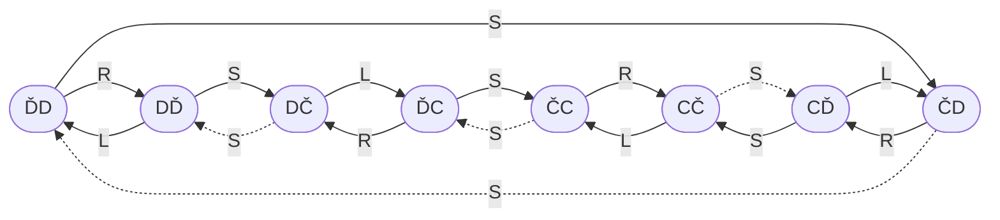

# Problems

## The vacuum world

World states:
1. `ĎD` – you are on the left, and both the left and right are dirty
2. `DĎ` – you are on the right, and both the left and right are dirty
3. `ĎC` – you are on the left, the left is dirty but the right is clean
4. `DČ` – you are on the right, the left is dirty but the right is clean
5. `ČD` – you are on the left, the left is clean but the right is dirty
6. `CĎ` – you are on the right, the left is clean but the right is dirty
7. `ČC` – you are on the left, and both the left and right are clean
8. `CČ` – you are on the right, and both the left and right are clean

### Deterministic

Actions:
- `L` – you move to the left
- `R` – you move to the right
- `S` – you activate the suction, which removes all the dirt from where you are

### Non-deterministic

Actions:
- `L` – you move to the left
- `R` – you move to the right
- `S` – you activate the suction, which either removes all the dirt from where you are, or deposits more dirt where you are, randomly

No sensors

Local dirt sensor – you know if there is dirt where you are

Next door dirt sensor – you know if there is dirt next door

----

Back up to: [Maglocunus](../index.md)
