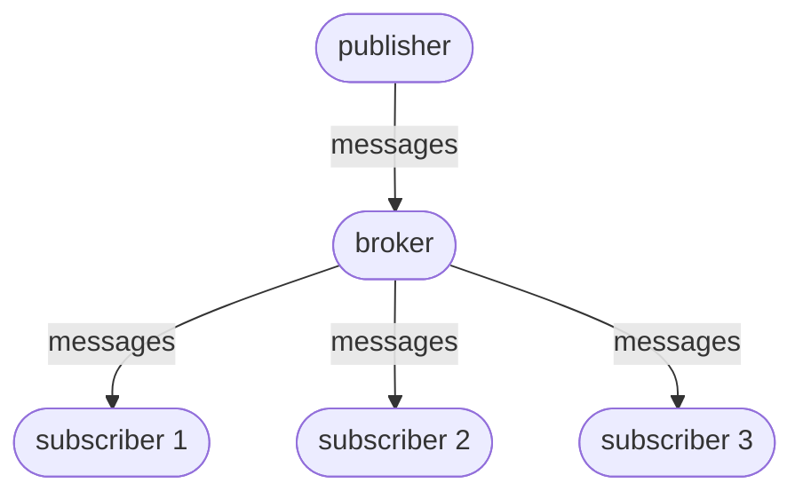

# Publish/subscribe

`Publish/subscribe` (pub/sub) is a messaging pattern where software components communicate indirectly through a message broker, rather than calling each other directly.

Instead of one component directly sending a message to another specific component, it publishes a message to a topic/channel on the message broker. Any components that have subscribed to that topic/channel automatically receive the message.

A subscriber can subscribe to:
- multiple topics/channels from the same broker
- multiple brokers.

Some popular message brokers are:
- Apache Kafka
- Amazon Simple Notification Service

Pub/sub is one of the most common ways to implement an `event-driven architecture`:
- the publisher is the event producer
- the message broker is the event router
- the subscriber is the event consumer.

----

Back up to: [Maglocunus](../index.md)
