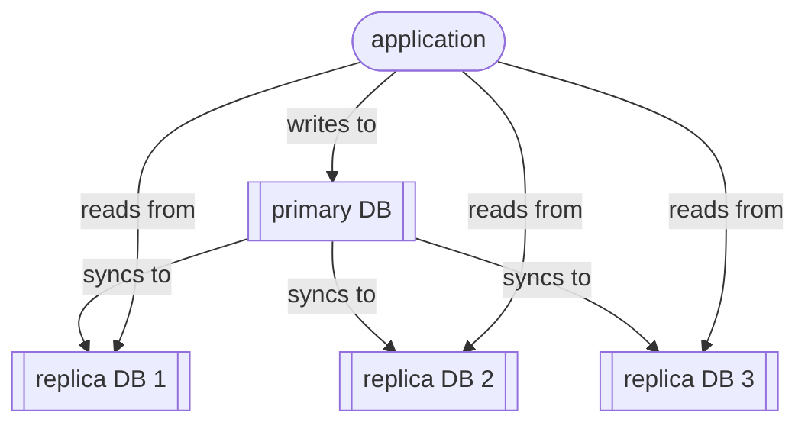

# Read replicas

`Read replicas` are synchronised, live copies of a primary database that are only used only for **read** operations (ie. `select` queries). 

Having read replicas allows you to scale read-heavy workloads without overloading the primary database, with the trade-off that they may briefly return ‘stale’ data due to *replication lag*.

Such replicas are sometimes known as ‘followers’ or ‘slaves’ of a ‘leader’ or ‘master’ database.

You should consider using read replicas if:
- your application has many more reads than writes
- you need to improve read response times (perhaps in different geographical regions)
- you have heavy analytics workflows that would otherwise slow down production writes

You should avoid querying read replicas whenever you need the most up-to-date data. 

Here's a simple diagram:

This kind of distributed database works as follows:
1. Your application sends all **writes** (inserts, updates, deletes) to the primary database.
2. The primary records those changes.
3. The changes are replicated to one or more read replicas.
4. Applications can send read queries to any replica.

Read replicas are distinct from failover replicas:
- A failover replica is designed for *high availability* – it can take over as the primary during an outage.
- A read replica is designed for scaling reads.

Many relational database systems support read replicas, including MySQL, PostgreSQL, MariaDB, SQL Server, Oracle Database, and managed cloud services like Amazon RDS, Google Cloud SQL, and Azure Database services.

Sources:
- Chapter 3 ‘Architecting read-side data’ of *Data Architecture* by Pramos Sadalage & Premanand Chandrasekaran (O’Reilly 2026)

----

Back up to: [Maglocunus](../index.md)

