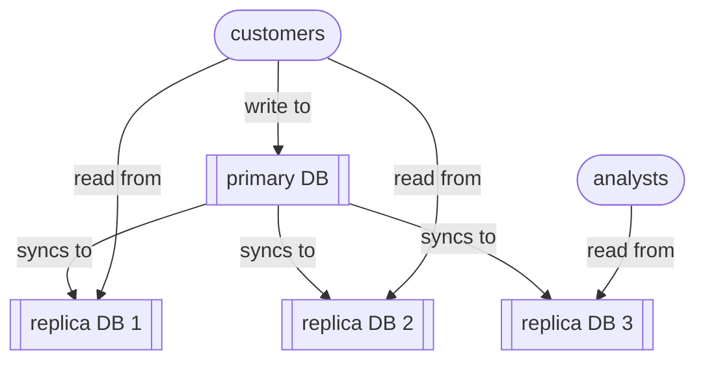

# Read replicas

`Read replicas` are synchronised, live ‘follower’ copies of a primary ‘leader’ database that are only used only for **read** operations (ie. `select` queries). 

Read replication, a data-architectural pattern, allows you to *scale read-heavy workloads* (and *optimise read performance*) in predominantly transactional systems, without overloading the primary database. The trade-off is that read replicas may briefly return ‘stale’ data due to *replication lag*.

A typical problem is where a business has expanded it activities to such an extent that its original monolithic transaction database is struggling with too many read queries – from customers browsing the website, or internal operational analytical dashboards. Query performance optimisations (eg. indexing) alone are not enough to scale read operations without compromising core transactions (ie. writes).

So rather than:

Read replication gives us something like:

This kind of distributed database works as follows:
1. Your application sends all **writes** (inserts, updates, deletes) to the primary database.
2. The primary records those changes.
3. The changes are replicated to one or more read replicas.
4. Applications can send read queries to any replica.

You should consider using read replicas if:
- your application has many more reads than writes
- you need to improve read response times (perhaps in different geographical regions)
- you have heavy analytics workflows that would otherwise slow down production writes

You should avoid querying read replicas whenever you need the most up-to-date data. 

Read replicas are distinct from failover replicas:
- A failover replica is designed for *high availability* – it can take over as the primary during an outage.
- A read replica is designed for scaling reads.

Many relational database systems support read replicas, including MySQL, PostgreSQL, MariaDB, SQL Server, Oracle Database, and managed cloud services like Amazon RDS, Google Cloud SQL, and Azure Database services.

Other data-architectural patterns that attempt to solve the problem of scaling read-heavy workloads:
- materialised views
- Command Query Responsibility Segregation (CQRS)
- Change Data Capture (CDC)
- event sourcing
- domain-based decomposition, polyglot persistence 

Sources:
- Chapter 3 ‘Architecting read-side data’ of *Data Architecture* by Pramos Sadalage & Premanand Chandrasekaran (O’Reilly 2026)

----

Back up to: [Maglocunus](../index.md)

