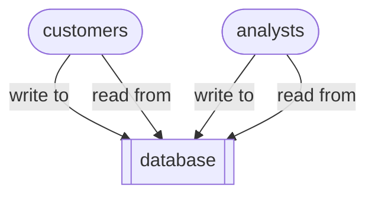

# Read replicas

`Read replicas` are synchronised, live ‘follower’ copies of a primary ‘leader’ database that are only used only for **read** operations (ie. `select` queries). 

Read replication is a data-architectural pattern that allows you to scale *read-heavy workloads* (and to optimise read performance) in predominantly transactional systems, without overloading the primary database. The trade-off is that read replicas may briefly return ‘stale’ data due to *replication lag*.

A typical problem is where a business has expanded it activities to such an extent that its original monolithic transaction database is struggling with too many read queries – from customers browsing the website, or internal operational analytical dashboards. Query performance optimisations (eg. indexing) alone are not enough to scale read operations without compromising core transactions (ie. writes).

So rather than:

Read replication gives us something like:

This kind of distributed database works as follows:
1. The customer-facing application sends all **writes** (inserts, updates, deletes) to the primary database.
2. The primary database records those changes.
3. The changes are replicated to the replicas.
4. All **read** queries are then sent directly to one of the replicas, thus freeing up the primary database.

Relational database systems typically offer two different approaches to replication:
- *statement-based* replication – the primary database logs incoming SQL write statements and then replays them on the replicas
- *row-based* replication – the primary database actually replicates actual row changes.

In addition, there are two different replication *modes*:
- *synchronous* replication – the primary database waits for the replicas to confirm the changes before acknowledging a write (trading write latency for read consistency)
- *asynchronous* replication – the primary database immediately acknowledges writes (trading read consistency for write latency).

Hybrid replication strategies are also available, for example using synchronous replication within a region (datacentre), but asynchronous replication across regions.

There are different replication *topologies*:
- single-primary with multiple replicas (possibly in different geo-locations)
- primary replica cascading – one replica acts an an intermediary between the primary database and the other replicas

Read replicas are distinct from *failover replicas*:
- A failover replica is designed for *high availability* – it can take over as the primary during an outage.
- A read replica is designed for scaling reads.

You should consider using read replicas if:
- your application has many more reads than writes
- you need to improve read response times (perhaps in different geographical regions)
- you have heavy analytics workflows that would otherwise slow down production writes.

You should avoid querying read replicas whenever you need the most up-to-date data. 

In addition, read replicas may struggle with certain compute-intensive queries, particularly those involving:
- aggregations
- pre-computed summaries
- complex joins across multiple datasets.

Some mitigation strategies for the risks of read replication are:
- replica lag monitoring to detect when replicas fall behind
- clear query routing strategies to dynamically direct queries to fresher replicas (database-aware load balancers)
- auto-scaling to dynamically adjust the number of replicas based on load.

Many relational database systems support read replicas, including MySQL, PostgreSQL, MariaDB, SQL Server, Oracle Database, and managed cloud services like Amazon RDS, Google Cloud SQL, and Azure Database services.

Other data-architectural patterns that attempt to solve the problem of scaling read-heavy workloads:
- [materialised database views](../m/materialised_views.md)
- Command Query Responsibility Segregation (CQRS)
- Change Data Capture (CDC)
- event sourcing
- domain-based decomposition, polyglot persistence 

Sources:
- Chapter 3 ‘Architecting read-side data’ of *Data Architecture* by [Pramod Sadalage](https://sadalage.com) & Premanand Chandrasekaran (O’Reilly 2026).

----

Back up to: [Maglocunus](../index.md)

