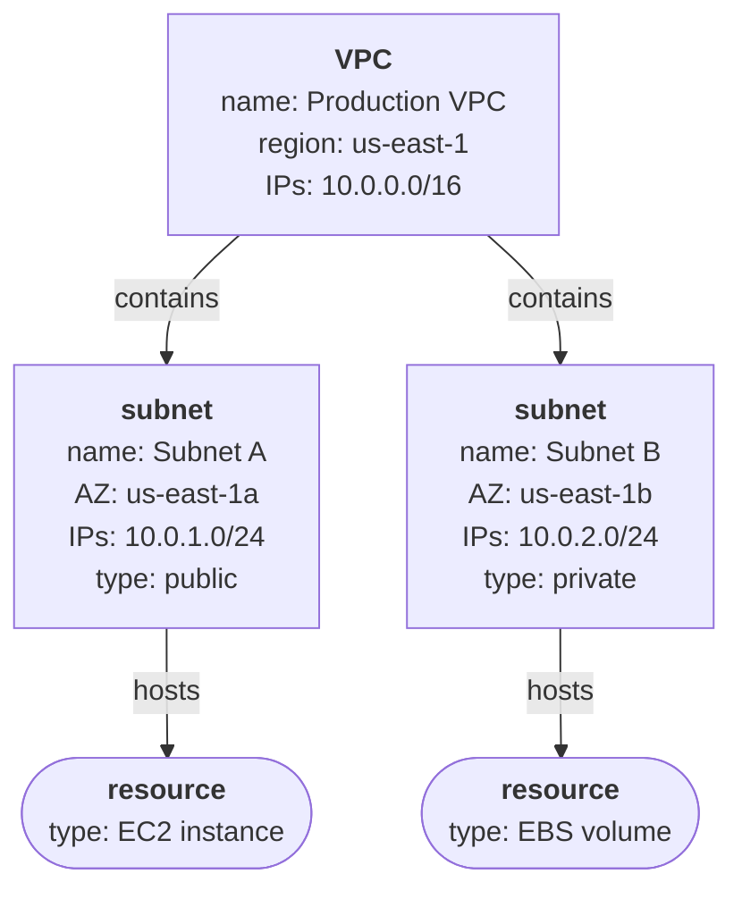
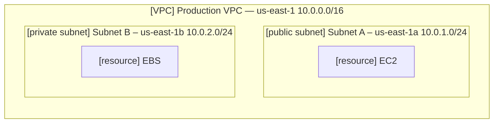
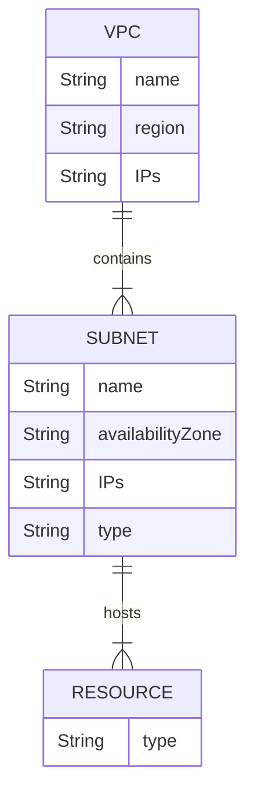

# Virtual Private Clouds

A `Virtual Private Cloud` (VPC) is a logically isolated virtual network on [Amazon Web Services](../a/AWS.md) (AWS).

A VPC:
- resembles a traditional network in an on-premises data centre
- resides in a single AWS region
- contains subnets
- are isolated by default – resources in different VPCs do not talk to each other, even if they are in the same AWS region.

A subnet: 
- consists of a range of IP addresses
- resides in a single availability zone
- is where resources are launched (EC2 instances, EBS volumes, etc)
- can be configured as *public* or *private*:
  - public: has a route to an internet gateway, allowing both outgoing and incoming access to the internet, and typically hosts web servers.
  - private: has a route to a network access translation (NAT) device, allowing outgoing access to the internet (but not incoming), and typically hosts database servers.

Here is an example:

Or in more traditional notation:

Here is an ER diagram:

Note that:

>  `10.0.0.0/16` means all IPv4 addresses from `10.0.0.0` to `10.0.255.255`, a CIDR (Classless Inter-Domain Routing) block containing 65,536 IP addresses.
>
> `10.0.1.0/24` is a subnet of this containing `10.0.1.0` to `10.0.1.255` ie. 256 IP addresses.
>
> When configuring a VPC, be sure to choose a CIDR block large enough to accommodate your current resources and allows for scalability in future.

Two VPC can be ‘peered’ (ie. connected) just in case their IP ranges do not overlap.

Use security groups and network access control lists (NACLs) to filter inbound and outbound traffic.

Security groups are applied to instances; NACLs are applied to subnets.

VPC peering allows direct connectivity between VPCs – instances in either VPC can communicate with each other as if they were in the same network.

Peering VPCs can belong to the same or different AWS accounts.

Use AWS VPN or AWS Direct Connect to connect your VPC with an on-premises environment.
- AWS VPN allows you to create an IPsec site-to-site VPN with your on-premises network.
- AWS Direct Connect establishes a dedicated private connection from your on-premises network to your VPC.

If you spread resources across multiple subnets, they will be highly available and fault tolerant.
- Especially if you se services like Elastic Load Balancing and Auto Scaling.

Compliance and data residency.

VPCs support both IPv4 and IPv6.

Subnets can be shared with other accounts in the same AWS organisation.
- You can keep VPCs to a minimum, while keeping separate accounts for billing.

- 

  

----

Back up to: [Maglocunus](../index.md)
