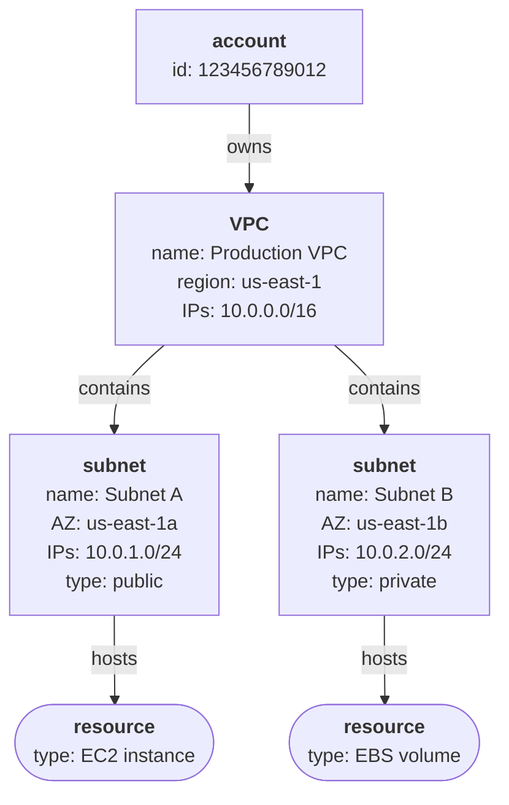
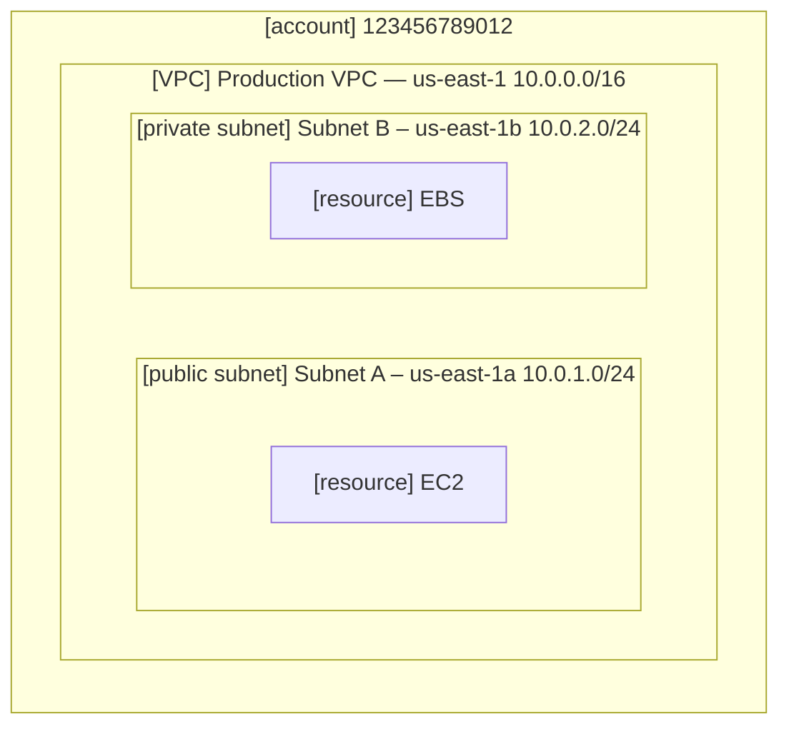
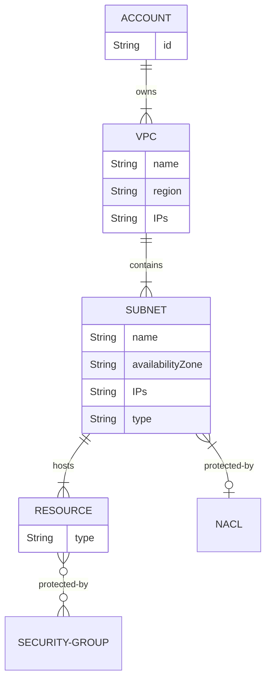
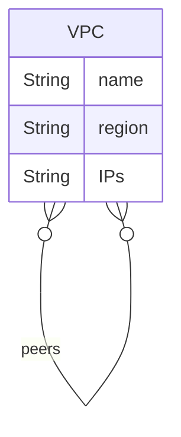
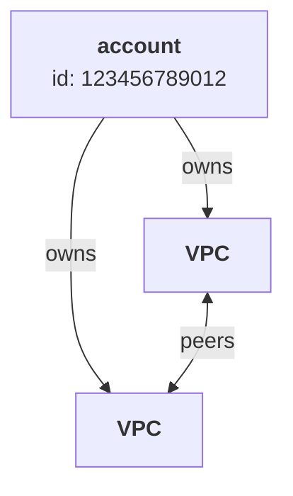
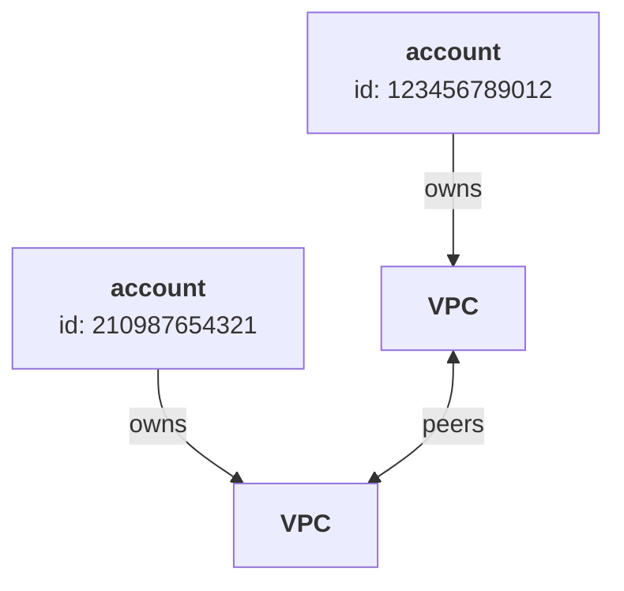

# Virtual Private Clouds

A `Virtual Private Cloud` (VPC) is a logically isolated virtual network within a single [Amazon Web Services](../a/AWS.md) (AWS) account.

Contents:
- [VPCs and subnets](#vpcs-and-subnets)
- [VPC peering](#vpc-peering)
- [VPN and Direct Connect](#vpn-and-direct-connect)

## VPCs and subnets

A VPC:
- architecturally resembles a traditional network in an on-premises data centre
- resides in a single AWS region
  - allowing for easier compliance with regulatory requirements, such as data residency
- contains subnets
- are isolated by default – resources in different VPCs do not talk to each other, even if they are in the same AWS region
- support both IPv4 and IPv6 addresses
- can be created and managed using the AWS `VPC` service.

A subnet: 
- consists of a range of IP addresses
- resides in a single availability zone
- is where resources are launched (EC2 instances, EBS volumes, etc)
- can be configured as *public* or *private*:
  - public: has a route to an internet gateway, allowing both outgoing and incoming access to the internet, and typically hosts web servers
  - private: has a route to a network access translation (NAT) device, allowing outgoing access to the internet (but not incoming), and typically hosts database servers
- can be protected by *network access control lists* (NACLs), which filter inbound and outbound traffic
  - all VPCs have a default NACL that can be overridden at subnet level
  - one NACL can apply to multiple subnets, but each subnet has at most one NACL
  - contain both allow and deny rules, ranked for precedence
  - are stateful – even if an outbound request is allowed, the corresponding incoming response might not be
  - a NACL applies to all resources within the subnet
- specific resources/instances in a subnet can be protected by *security groups* (ie. virtual firewalls)
  - only contain allow rules; anything not explicitly allowed is denied
  - one security group can be used by multiple resources; multiple resources can be associated with one security group
  - are stateful – if an outbound request is allowed, so is the corresponding incoming response
- can be shared with other accounts in the same AWS organisation
  - users of the other account can launch resources on the shared subnet (managed by the AWS `Resource Account Manager` service)
  - keeping VPCs to a minimum, while keeping separate accounts for billing.

If you spread resources across multiple subnets, they will be more available and fault tolerant, especially if you use services like Elastic Load Balancing and Auto Scaling.

Here is an example:

Or in more traditional notation:

Here is an ER diagram:

Note that:

>  `10.0.0.0/16` means all IPv4 addresses from `10.0.0.0` to `10.0.255.255`, a CIDR (Classless Inter-Domain Routing) block containing 65,536 IP addresses.
>
> `10.0.1.0/24` is a subnet of this containing `10.0.1.0` to `10.0.1.255` ie. 256 IP addresses.
>
> When configuring a VPC, be sure to choose a CIDR block large enough to accommodate your current resources and allows for scalability in future.

Use security groups and network access control lists (NACLs) to filter inbound and outbound traffic.

Security groups are applied to instances; NACLs are applied to subnets.

Back up to: [Top](#)

## VPC peering

Two VPCs can be ‘peered’ (ie. connected) as long as their IP ranges do not overlap.
- VPC peering allows instances in either VPC to communicate with each other as if they were in the same network.
- Peering VPCs can belong to the same or different AWS accounts.

In other words:

Here is an example of same-account peering:

Here is an example of cross-account peering:

Back up to: [Top](#)

## VPN and Direct Connect

There are two ways to securely connect your on-premises environment with your AWS VPC, so as to shares resources:
- AWS site-to-site VPN
- AWS Direct Connect.

A site-to-site VPN is a secure connection between your on-premises equipment and your VPCs, over the public internet. 
This connection requires two termination points:
- a virtual private gateway (or a transit gateway) attached to your AWS VPC
- a (hardware or software) customer gateway device on your side of the site-to-site VPN connection.
Using the IPsec protocol allows for a secure connection.
 
AWS Direct Connect establishes an even more secure, dedicated private connection from your on-premises network to your VPC
- bypassing the public internet
- more bandwidth and lower latency
- ideal for large-scale, secure data migration.

Back up to: [Top](#)

----

Back up to: [Maglocunus](../index.md)
